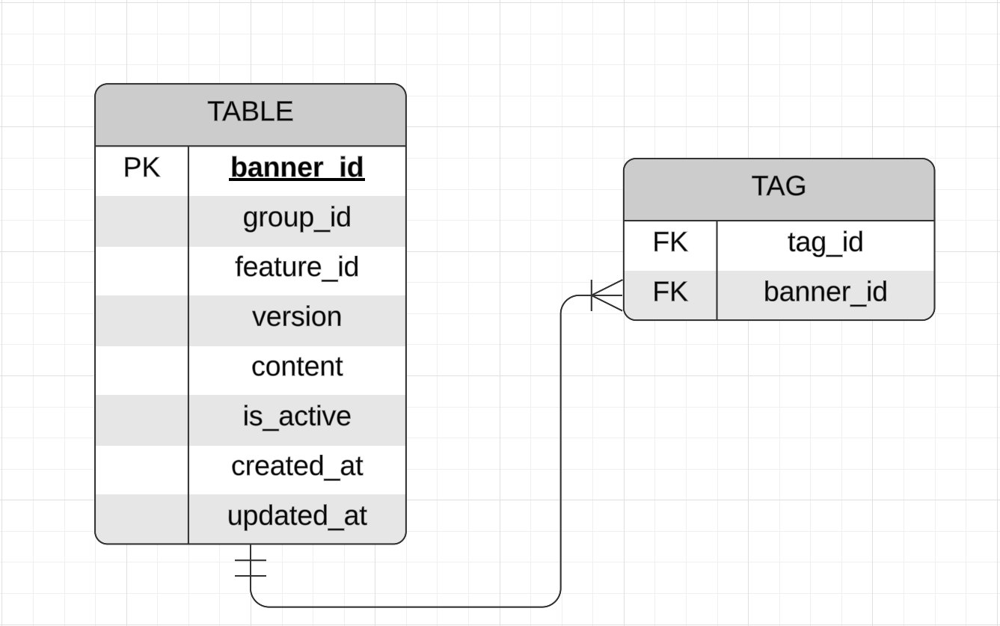

# Тестовое задание для стажёра Backend

Этот репозиторий содержит реализацию тестового задания на позицию стажёра-бэкендера в Avito. Микросервис написан на Go 1.22, СУБД - PostgreSQL.

## Тестовое задание

Тестовое задание доступно по ссылке: [Avito Backend Trainee Assignment 2024](https://github.com/avito-tech/backend-trainee-assignment-2024)

## Выполнено 
- Реализован сервис, удовлетворяющий заданному API
- Тегов и фичей небольшое количество (до 1000), RPS — 1k, SLI времени ответа — 50 мс, SLI успешности ответа — 99.99%
- Сделана авторизация пользователей. Также есть разделение на админа и обычного пользователя
- Eсли при получении баннера передан флаг use_last_revision, необходимо отдавать самую актуальную информацию. В ином случае допускается передача информации, которая была актуальна 5 минут назад.
- Баннеры могут быть временно выключены. Если баннер выключен, то обычные пользователи не должны его получать, при этом админы должны иметь к нему доступ.
- Проведено нагрузочное тестирование полученного решения и приложить результаты тестирования к решению
- Изменено API таким образом, чтобы можно было просмотреть существующие версии баннера и выбрать подходящую версию
- Был добавлен метод удаления баннеров по фиче или тегу.


## Не выполнено

- Не добавлен механизм отложенного удаления баннеров по фиче или тегу.
- Не была проверена адаптивность системы для значительного увеличения количества тегов и фичей, при котором допускается увеличение времени исполнения по редко запрашиваемым тегам и фичам.
- Отсутствуют E2E-тесты для всех сценариев.
- Отсутствует файл конфигурации линтера.

## Запуск

Для запуска требуется выполнить следующие шаги:

1. Скачать исходный код и перейти в директорию с проектом:
```text
git clone https://github.com/Gervva/avito_test_task.git
cd avito_test_task
```
2. Настроить переменные окружения. В корне проекта есть [.env](.env) файл со значениями переменных окружения по умолчанию.
```text
    PG_HOST = <хост_который_будет_использовать_бд>
    PG_PORT = <порт_который_будет_использовать_бд>
    PG_USER = <имя_пользователя_которое_будет_использовать_бд>
    PG_PASSWORD = <пароль_который_будет_использовать_бд>
    PG_DATABASE_NAME = <имя_бд>

    CACHE_HOST = <хост_который_будет_использовать_кэш>
    CACHE_PORT = <порт_который_будет_использовать_кэш>

    MICROSERVICE_PORT = <порт_на_котором_будут_прослушиваться_http_подключения>
```

3. Для развертывания среды:
    + Запустить контейнеры с базой данных, сервисом и редисом
   ```
   docker-compose -f docker-compose.yml up --build 
   ```

# Детали реализации

## Структура проекта
```
avito_test_task/     
├─ cmd/
│  ├─ service/         точка входа в сервис
├─ internal/   
│  ├─ handlers/        слой сетевого взаимодействия
│  ├─ repository/      слой для взаимодействия с базой и кэшем
│  ├─ service/         слой бизнес-логики
│  ├─ storage/         слой взаимодействия с данными
│  │  ├─ database/     взаимодействие с базой
│  │  ├─ cache/        взаимодействие с кэшем
├─ dock/               API
├─ pkg/
│  ├─ authorisation/   аутентификация пользователя
```

## Хранение в базе данных
Ниже представлена реляционная модель базы данных



## Изменение API 

Изменения, которые были внесены в [API](docs/api.yaml):

+ Добавлена ручка `get_all_versions` для получения всех версий баннера для указанного `banner_id`.
+ Добавлена ручка `get_banner_version` для получения конкретной версии баннера. Запрос принимает `query`-параметры `banner_id` и `version`.
+ Добавлена ручка `delete_by_feature_tag` для удаления баннеров по фиче или тегу. Запрос принимает `query`-параметры `feature_id` или `tag_id`.
+ Добавлен параметр `version` в метод обновления банера.

## Нагрузочное тестирование

Для нагрузочного тестирования использовался [вспомогательный интсрумент](https://github.com/linkxzhou/http_bench). Тестирование проводилось для ручки `GET banner`. Результаты тестирования представлены в папке [test_results](test_results)

## Вопросы по ТЗ и их решения

### Вопрос

Как осуществлять аутентификацию пользователя?

### Ответ

Было реализовано `middlware`, которое вызывает внешнюю функцию для получения роли пользователя. Решение о том, имеет ли пользователь доступ к вызываемому методу принмает само `middlware`.

### Вопрос

Как осуществлять хранение и получение баннеров с учетом версий?

### Ответ

Было принято решение добавить идентификатор группы баннера `group_id` и номер версии version для определения принадлежности баннера к определённой сущности баннера. Стоит отметить, что параметр `banner_id`, который используется в запросах к сервису, в самом сервисе и в БД имеет имя и значение `group_id`. Так как теперь несколько баннером могут иметь одинаковое значение параметра group_id, было принято решение добавить новый уникальный идентификатор баннера - настоящий `banner_id` (`PK`).
Простыми словами, пользователь будет знать только `group_id` баннера и использовать его в сетевых запросах. Однако возникают вопросы по поводу получение баннеров, так как теперь переданный параметр `banner_id` олицетворяет не один конретный баннер, а целую группу версий баннера.

Для ответов на подобные вопросы в `API` были внесены следующие изменения:
- `GET banner` теперь возвращает последнюю версию для запрашиваемых баннеров.
- `GET user_banner` возвращает последнюю версию запрашиваемого баннера
- `PATCH banner` не обновляет существующий баннер, а создает новую версию баннера. Если количество версий одного баннера превышвет `4`, то удаляется баннер самой старой версии (с наименьшим значением поля `version`). Для обновления конкретных полей баннера берется самая последня версия данного баннера. Чтобы не происходило проблем при одновременном обновлении баннера, в параметрах запроса необходимо указывать последнюю версию баннера, которая существует. Таким образом, если пользователь хотел обновить баннер и взять за основу последнюю версию `N`, однако при получении запроса сервером номер последней существующей версии `N+1`, то изменения не будут применены, что избавит от перетирования версий баннера. При обновлении баннера в новой версии обновляется поле `updated_at`, поле `created_at` переносится из предыдущей версии.

Согласно данной логике версионирование баннеров можно рассматривать как хранение истории изменения баннера.

### Вопрос

Как организовать кэширование запроса?

### Ответ

Для хранения кэша была выбрана СУБД `Redis`.
Для кэширования запроса `GET user_banner` была выбрана такая стратегия кэширования, при которой кэш изначально пуст. При обработке запроса на получение баннера пользователя, сначала проверяется наличие баннера в кэше. Если там он отсутствует, то производится запрос на получение к БД, и далле баннер сохраняется в кэше. При этом указывается `TTL` кэша.
Также было принято решение удалять редко используемый кэш, однако данный функционал не был добавлен в проект в связи с нехваткой времени. Стоит также отметить что не были проведены тесты для сравнения времени выполения запроса с использваонием кэша и без.

## Дополнительно

- Был добавлен логгер для вывода ошибки, возникающей при обработке запроса сервисом.